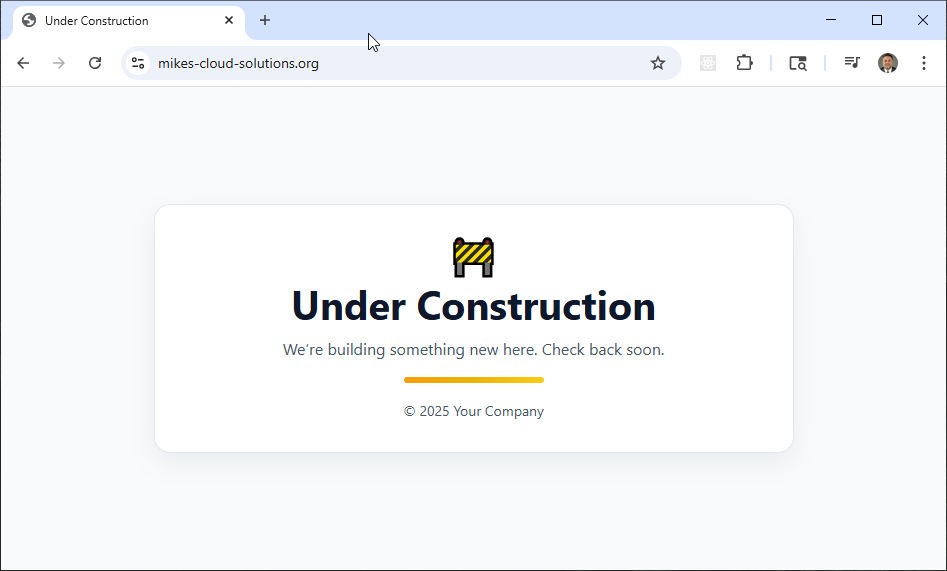

## Simple Website in AWS with Terraform & CloudFront

This project automates the deployment of a fully secure, production-ready **static website on AWS**, leveraging **Terraform** for infrastructure-as-code and **CloudFront** for global HTTPS delivery. The site’s content is hosted in an **Amazon S3 bucket**, served through **CloudFront** with an **ACM-issued SSL certificate**, ensuring fast and secure access from anywhere in the world.

The included Bash scripts (`apply.sh`, `check_env.sh`, and `destroy.sh`) streamline the full lifecycle — from environment validation and provisioning to clean teardown — making this an ideal foundation for static website hosting, personal portfolios, or documentation portals.



**Note:** The only manual step in this process is **domain registration**. This project assumes you register your domain manually in the AWS Management Console (via Route 53). Once the domain is created and the hosted zone exists, Terraform takes over — automating the rest of the deployment, including S3 storage, CloudFront distribution, and ACM certificate provisioning.   In the accompanying video tutorial, we walk through these manual domain registration steps in detail before moving into the Terraform automation.

## Key Features

- **Manual Domain Setup**: Domain registration is handled in the AWS console; all other steps are fully automated through Terraform and scripts.  
- **Infrastructure as Code (IaC)**: All AWS resources are defined declaratively in Terraform for reproducibility and version control.  
- **HTTPS Everywhere**: Automatically provisions an SSL certificate via AWS Certificate Manager (ACM) and enforces HTTPS through CloudFront.  
- **Secure Origin Access**: Uses CloudFront Origin Access Control (OAC) to restrict direct S3 access, protecting the site from public exposure.  
- **Automated Lifecycle**: Shell scripts manage build, validation, and teardown, simplifying infrastructure operations.  

## Prerequisites

* [A Registered Domain](https://docs.aws.amazon.com/Route53/latest/DeveloperGuide/domain-register.html)
* [An AWS Account](https://aws.amazon.com/console/)
* [Install AWS CLI](https://docs.aws.amazon.com/cli/latest/userguide/getting-started-install.html) 
* [Install Latest Terraform](https://developer.hashicorp.com/terraform/install)

If this is your first time watching our content, we recommend starting with this video: [AWS + Terraform: Easy Setup](https://youtu.be/BCMQo0CB9wk). It provides a step-by-step guide to properly configure Terraform, Packer, and the AWS CLI.

## Deployment Flow


*Figure 1: End-to-end build process for the simple AWS website.*


## Download this Repository

```bash
git clone https://github.com/mamonaco1973/aws-website.git
cd aws-website
```

## Build the Code

Run [check_env](check_env.sh) then run [apply](apply.sh).

```bash
~/aws-website$ ./apply.sh
NOTE: Validating that required commands are found in your PATH.
NOTE: aws is found in the current PATH.
NOTE: terraform is found in the current PATH.
NOTE: jq is found in the current PATH.
NOTE: All required commands are available.
NOTE: Checking AWS cli connection.
NOTE: Successfully logged into AWS.
NOTE: Building networking infrastructure.
Initializing the backend...
Initializing provider plugins...
- Finding latest version of hashicorp/aws...
- Finding latest version of hashicorp/random...
- Installing hashicorp/aws v5.96.0...
- Installed hashicorp/aws v5.96.0 (signed by HashiCorp)
- Installing hashicorp/random v3.7.2...
- Installed hashicorp/random v3.7.2 (signed by HashiCorp)
Terraform has created a lock file .terraform.lock.hcl to record the provider
selections it made above. Include this file in your version control repository
so that Terraform can guarantee to make the same selections by default when
you run "terraform init" in the future.

Terraform has been successfully initialized!
```

## Build Results

After a successful run of `apply.sh`, Terraform provisions a complete static website infrastructure on AWS. The following resources are created and configured automatically:

| Component | Description |
|------------|--------------|
| **S3 Bucket** | Stores all website content (e.g., `index.html`). Configured for static website hosting with public access disabled and CloudFront as the only allowed origin. |
| **ACM Certificate** | Validates domain ownership and secures the CloudFront distribution with SSL/TLS encryption. The certificate is provisioned in the **us-east-1** region, as required by CloudFront. |
| **CloudFront Distribution** | Delivers website content globally over HTTPS. Uses the S3 bucket as its origin and automatically redirects all HTTP requests to HTTPS. |
| **Route 53 Hosted Zone** | Contains DNS records associated with the manually registered domain (created in the AWS Console). CloudFront’s distribution URL will be aliased to this hosted zone |
|

Once the build completes, Terraform outputs the CloudFront distribution URL — for example:

```
Outputs:

website_url = "https://mikes-cloud-solutions.com"
```

You can visit this URL to confirm successful deployment. The default `index.html` displays an **“Under Construction”** page, which can later be replaced by your production site content.

---

**Teardown:**  
To remove all resources and avoid unnecessary costs, run:

```bash
./destroy.sh
```
This command safely destroys all Terraform-managed infrastructure while leaving your manually registered domain intact.

